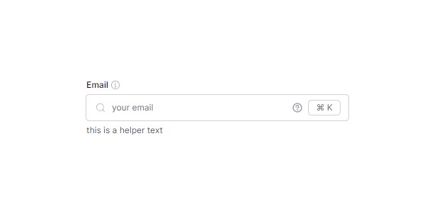
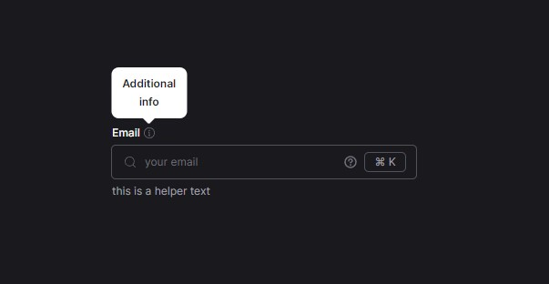

# Input Component + StoryBook

The Input component accepts the following props:

**type:** "text" | "password" | "email" | "number" | "tel" | "url" | "date" | "time" | "datetime-local"; **sizes:** "xs"
| "sm" | "lg" | "xl"; **label:** string **placeholder:** string **required:** boolean **error:** boolean **errorText:**
string and other

## For convenience, StoryBook has been added, which can be started by running the command

`npm run storybook`

Three color schemes have been implemented: dark, light, and drop. In drop mode, a drag-and-drop mechanism has been
implemented for transferring the component from dark mode to light mode.

